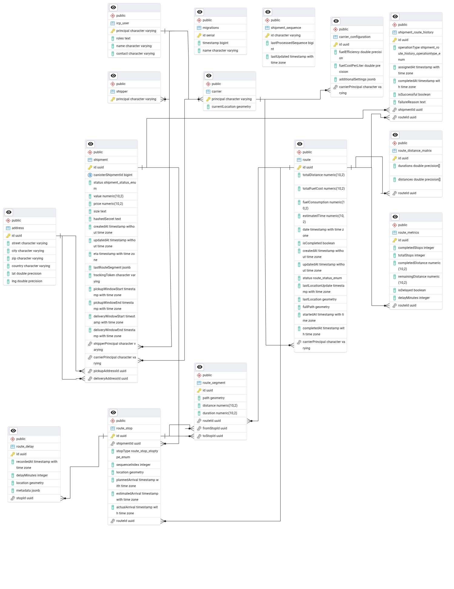

# Peer-to-Peer Shipping Platform

## Overview
A decentralized shipping platform that connects individual shippers with independent carriers. The platform enables anyone to ship items by creating shipments and allows independent carriers to bid on and fulfill these deliveries. Built with NestJS and SvelteKit, it features real-time tracking, secure payments through Internet Computer (IC), and a trust system based on carrier deposits.

Key aspects:
- Individuals can create and pay for shipments
- Independent carriers can earn by delivering packages
- Deposit-based trust system for carriers
- Real-time tracking for all parties
- Decentralized payment and authentication
- Route optimization for efficient deliveries

## Architecture

### Overall System Architecture
The system is composed of three main components that communicate through well-defined interfaces:

1. **Internet Computer (IC) Canister**
   - Core business logic and state management
   - Smart contract implementation for shipment lifecycle
   - Decentralized authentication and authorization
   - Event sourcing for shipment state changes
   - Clear interface with backend through principal-based authentication and event system

2. **Backend API Service**
   - REST API for client applications
   - Real-time updates through WebSocket connections
   - Integration layer between IC and client applications
   - Route optimization and tracking logic
   - Event processing and synchronization with IC

3. **Mailer Service**
   - Independent microservice for email handling
   - Consumes events through RabbitMQ
   - Handles notification templates and delivery
   - Provides delivery status tracking

The components interact through:
- HTTP between frontend and backend and IC and backend
- Principal-based authentication with IC (frontend - backend, frontend - smart contract)
- Message queues for asynchronous communication (backend - mailer)
- Event-based synchronization for state management (backend - smart contract)

### Backend API Architecture
The backend API follows a traditional monolithic NestJS structure, chosen for:
- Rapid development
- Easier debugging
- Business logic changes

Current organization:

1. **Domain Modules**
   - **Auth**: Handles IC authentication synchronization and JWT management
   - **Shipments**: Processes shipment events from IC and manages local state
   - **Carriers**: Handles carrier profiles and vehicle management
   - **Routes**: Implements route optimization and tracking logic

2. **Infrastructure**
   - **Core Services**: Cross-cutting concerns and shared utilities
   - **Notifications**: Event dispatch to mailer service
   - **Database**: PostgreSQL with PostGIS for spatial data
   - **External APIs**: OpenRouteService integration

While currently monolithic, this structure was chosen to:
- Focus on business logic implementation
- Establish clear integration patterns with IC, how to sync and handle data to have single source of truth
- Enable rapid iterations and adjustments between unknown technologies 

Future improvements planned:
- Better module boundaries through domain events
- Reduction of circular dependencies
- Clear interfaces between modules
- Potential split into microservices if needed

### Frontend (SvelteKit)
A modern web application providing:
- Real-time shipment tracking interface
- Carrier and shipper dashboards
- Route visualization with MapLibre
- Responsive design using TailwindCSS

## Features

### Shipment Management
- Create and track shipments
- Real-time location updates
- Address geocoding and validation
- Time window management for pickups/deliveries
- Status tracking (PENDING, BOUGHT, ROUTE_SET, PICKED_UP, IN_DELIVERY, DELIVERED)
- Public tracking links for customers

### Route Optimization
- Advanced route optimization using OpenRouteService
- Real-time route tracking and updates
- ETA calculations and delay detection
- Multi-stop route planning
- Fuel consumption estimation

### Carrier Management
- Carrier registration and profile management
- Vehicle configuration
- Fuel efficiency tracking
- Real-time location updates
- Route assignment and management

### Authentication & Authorization
- Internet Computer (IC) integration for decentralized auth
- Role-based access control (USER, ADMIN, SHIPPER, CARRIER)
- Secure session management
- Challenge-based authentication flow

### Real-time Notifications
- Email notifications for important events
- RabbitMQ integration for reliable message delivery
- Configurable notification templates
- Event-driven updates

## Technology Stack

### Backend
- **NestJS**: Main application framework
- **TypeORM**: Database ORM with PostgreSQL
- **PostGIS**: Spatial database extension
- **RabbitMQ**: Message queue for notifications
- **OpenRouteService**: Route optimization and geocoding
- **Internet Computer**: Decentralized authentication and smart contracts
- **Node.js**: Runtime environment

### Frontend
- **SvelteKit**: Frontend framework
- **MapLibre**: Mapping and visualization
- **TailwindCSS**: Styling

### DevOps & Tools
- **Docker & Docker Compose**: Containerization
- **TypeScript**: Programming language
- **Swagger**: API documentation

## Database Design

### Key Tables

#### Users & Authentication
- **IcpUser**: Stores user information and roles
- **Shipper**: Links to ICP users with shipper role
- **Carrier**: Stores carrier information and configuration

#### Shipment Management
- **Shipment**: Core shipment information
  - Links to shipper and carrier
  - Tracks status and timeline
  - Stores value and price
  - Contains pickup/delivery windows
- **Address**: Stores geocoded addresses
  - Used for both pickup and delivery locations
  - Contains coordinates and address details

#### Route Management
- **Route**: Stores route information
  - Links to carrier
  - Contains path geometry
  - Tracks status and progress
- **RouteStop**: Individual stops in a route
  - Links to shipments
  - Contains arrival times and status
- **RouteSegment**: Path segments between stops
  - Contains distance and duration
  - Stores path geometry
- **RouteMetrics**: Performance metrics
  - Tracks completed/total stops
  - Monitors delays and progress
- **RouteDelay**: Records and tracks delays
  - Stores location and timing information
  - Contains delay reasons and updates

### ERD Diagram


## Getting Started

### Prerequisites
- Node.js ≥ 16.0.0
- PostgreSQL with PostGIS extension
- RabbitMQ
- Internet Computer SDK (DFX)
- Docker (optional)

### Installation

1. Clone the repository
2. Copy environment configuration:
```bash
cp .env.example .env
```

3. Start required services:
```bash
docker-compose up -d
```

4. Start local Internet Computer replica:
```bash
dfx start --clean --background
```

5. Deploy canisters:
```bash
dfx deploy
```

6. Run backend (development):
```bash
bun backend
```

7. Run frontend (development):
```bash
bun frontend
```

## API Documentation
API documentation is available at `/api/docs` when running the backend server, powered by Swagger/OpenAPI.